# Звіт про виконання Лабораторної роботи №3

---

### Завдання 1 — База даних
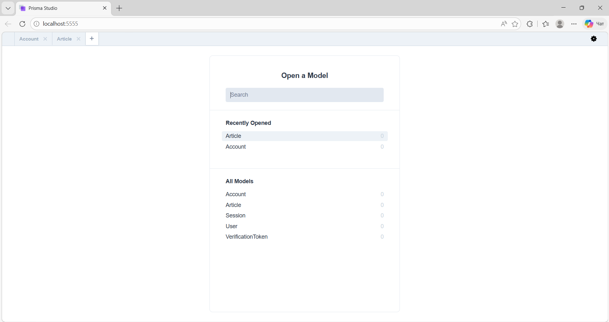

---

### Завдання 2 — Аутентифікація (Email / Пароль)
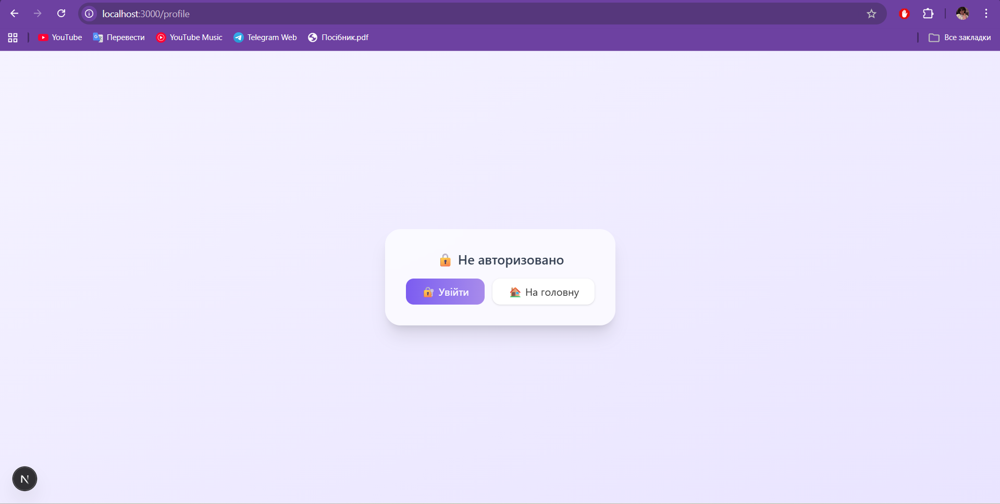
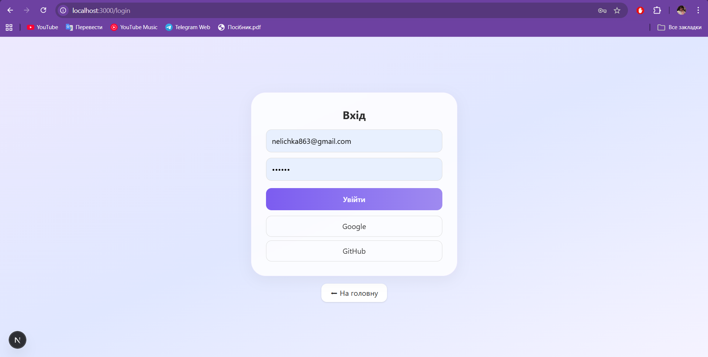

---

### Завдання 3 — Аутентифікація через Google
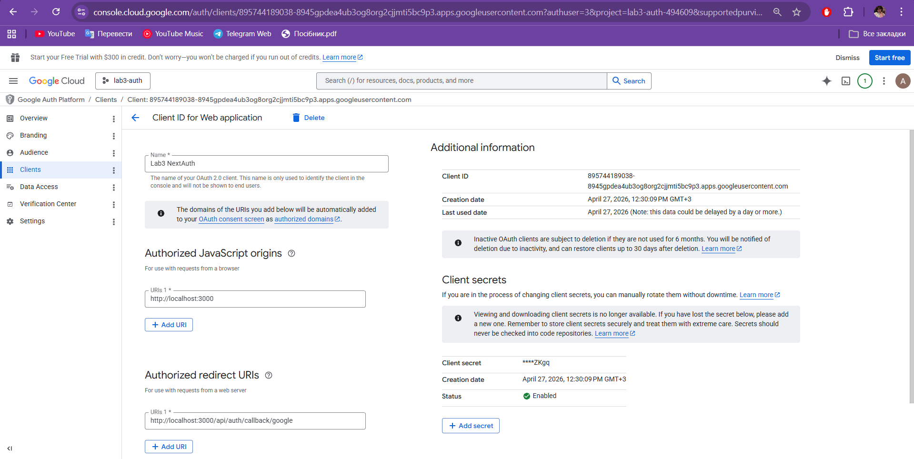

---

### Завдання 4 — Аутентифікація через GitHub
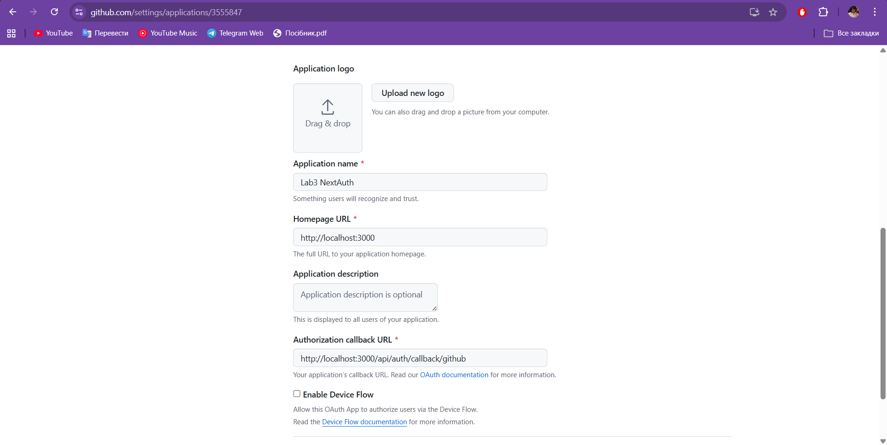

---

### Завдання 5 — Профіль користувача

#### 🔐 Вхід через Google
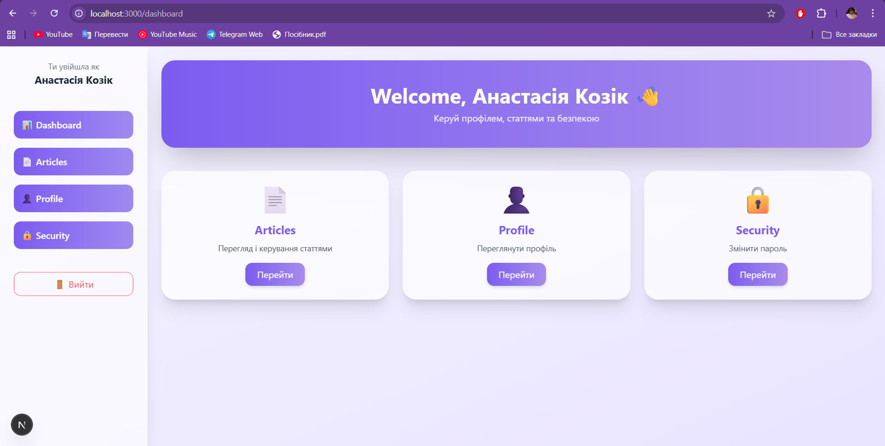
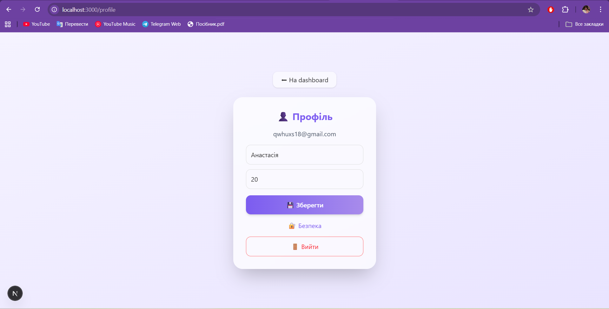

#### ✏️ Зміна даних профілю
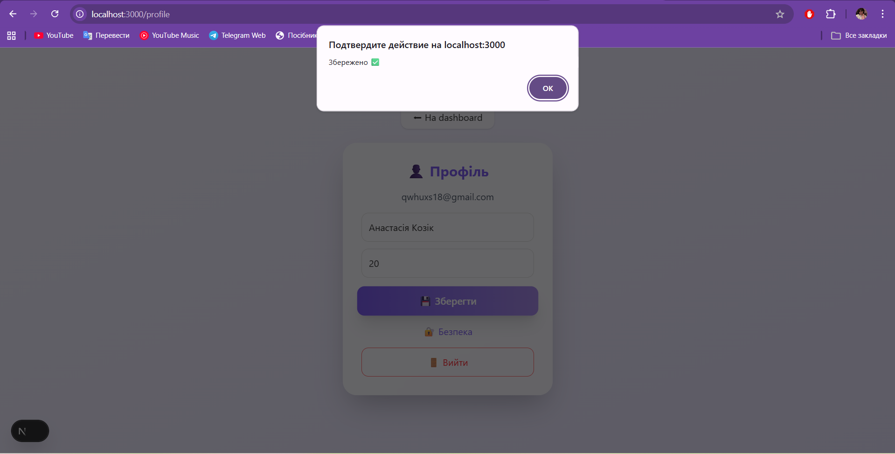

#### 🐙 Вхід через GitHub
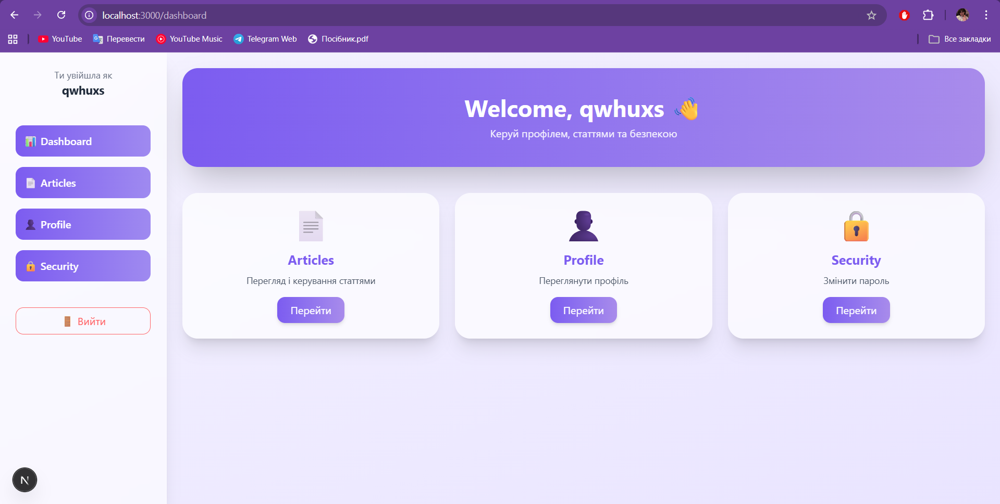
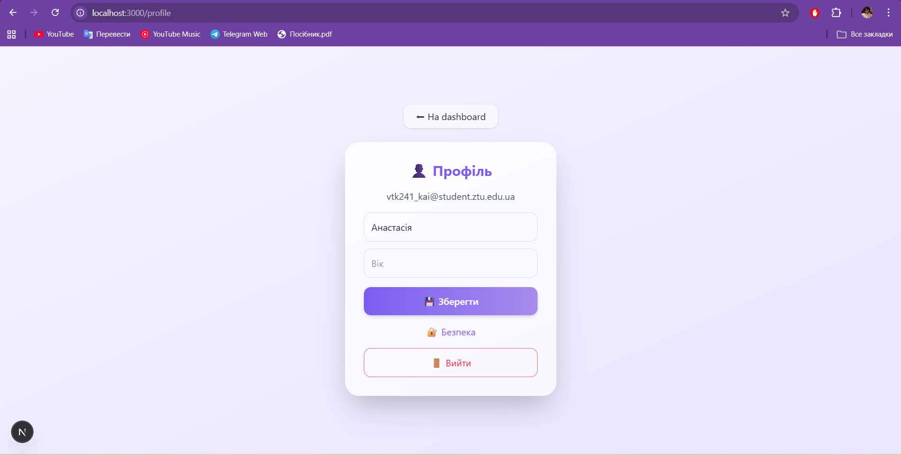

#### 🔐 Зміна паролю
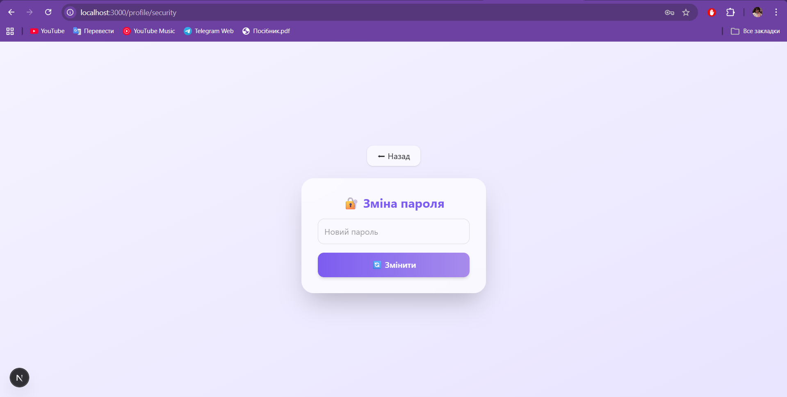
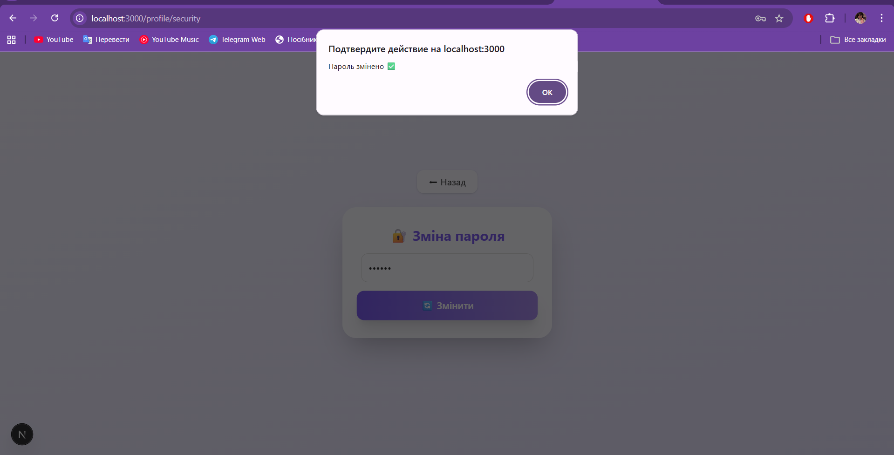

#### ❌ Якщо користувач не авторизований
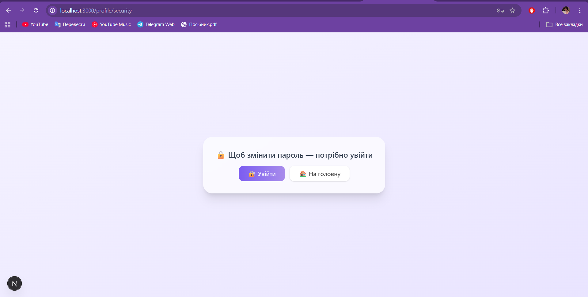

#### 🗄️ Зміни в базі даних(Користувачів)
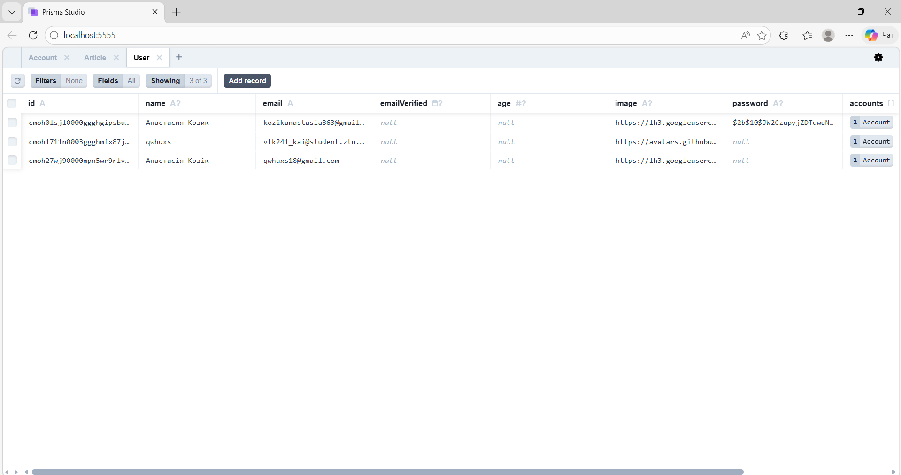

---